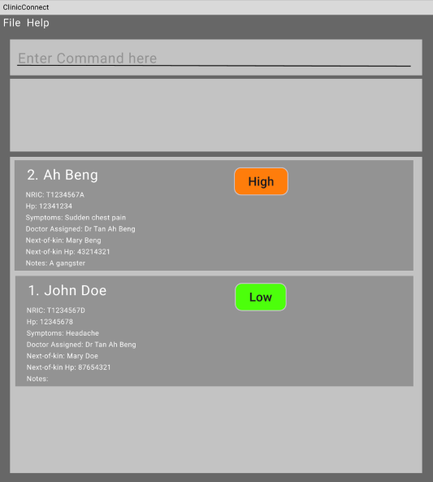

# ClinicConnect User Guide

ClinicConnect is a **desktop app for triage coordinators to manage patient records, optimized for use via a Command Line Interface** (CLI) while still having the benefits of a Graphical User Interface (GUI). If you can type fast, ClinicConnect can get your triage tasks done faster than traditional GUI apps.

<!-- * Table of Contents -->
<page-nav-print />

--------------------------------------------------------------------------------------------------------------------

## Quick start

1. Ensure you have Java `17` or above installed in your Computer. 
   **Mac users:** Ensure you have the precise JDK version prescribed [here](https://se-education.org/guides/tutorials/javaInstallationMac.html).

2. Download the latest `.jar` file from [here](https://github.com/se-edu/addressbook-level3/releases).

3. Copy the file to the folder you want to use as the _home folder_ for your AddressBook.

4. Open a command terminal, `cd` into the folder you put the jar file in, and use the `java -jar addressbook.jar` command to run the application. 
   A GUI similar to the below should appear in a few seconds. Note how the app contains some sample data. 
   

5. Type the command in the command box and press Enter to execute it. e.g. typing **`help`** and pressing Enter will open the help window. 
   Some example commands you can try:

    * `list` : Lists all patients.

    * `add pn/John Doe ic/T1234567B p/98765432 s/Fever u/moderate d/Dr Lee nk/Jane Doe nkp/87654321` : Adds a patient named `John Doe` to ClinicConnect.

    * `update 1 p/91234567` : Updates the phone number of the 1st patient shown in the current list.

    * `delete 3` : Deletes the 3rd patient shown in the current list.

    * `clear` : Deletes all patients.

    * `exit` : Exits the app.

6. Refer to the [Features](#features) below for details of each command.

--------------------------------------------------------------------------------------------------------------------

## Features

<box type="info" seamless>

**Notes about the command format:** 

* Words in `UPPER_CASE` are the parameters to be supplied by the user. 
  e.g. in `add pn/NAME`, `NAME` is a parameter which can be used as `add pn/John Doe`.

* Items in square brackets are optional. 
  e.g `pn/NAME [n/NOTES]` can be used as `pn/John Doe n/Fever and chills` or simply as `pn/John Doe`.

* Parameters can be in any order. 
  e.g. if the command specifies `pn/NAME p/PHONE_NUMBER`, `p/PHONE_NUMBER pn/NAME` is also acceptable.

* All commands and prefixes are case-insensitive.

* Leading and trailing spaces are ignored/trimmed automatically.

* Internal spaces inside a command or prefix are not allowed and will be rejected.

* Extraneous parameters for commands that do not take in parameters (such as `help`, `list`, `exit` and `clear`) will be ignored. 
  e.g. if the command specifies `help 123`, it will be interpreted as `help`.

* If you are using a PDF version of this document, be careful when copying and pasting commands that span multiple lines as space characters surrounding line-breaks may be omitted when copied over to the application.
</box>

### Viewing help : `help`

Shows a message explaining how to access the help page.

Format: `help`

### Adding a patient: `add`

Records comprehensive patient information (name, identification, contact details, medical urgency, and notes) and saves it to the hard disk.

Format: `add pn/<PATIENT NAME> ic/<IC NUMBER> p/<PATIENT PHONE NUMBER> s/<SYMPTOMS> u/<URGENCY LEVEL> d/<DOCTOR NAME> nk/<NEXT-OF-KIN NAME> nkp/<NEXT-OF-KIN PHONE NUMBER> [n/<NOTES>]`

<box type="tip" seamless>

**Tip:** The notes field `[n/<NOTES>]` is optional, but all other medical and contact fields must be provided to successfully register a patient!
</box>

Examples:
* `add pn/john doe jun kai ic/t0123456b p/123456789 s/diabetic u/high d/Dr Tan Ah Beng nk/mary doe nkp/234567890 n/admitted at 12pm`
* `add pn/john doe jun kai ic/t1234567b p/123456789 s/diarrhea u/low d/Dr Lim Ah Beng nk/jane doe nkp/987654321`

### Listing all patients : `list`

Displays all contacts currently stored in the application in a structured list format. This command does not take any parameters.

Format: `list`

### Updating a person : `update`

Updates an existing patient's details in ClinicConnect.

Format: `update INDEX [pn/NAME] [p/PHONE] [ic/IC] [u/URGENCY_LEVEL] ...`

* Edits the person at the specified `INDEX`. The index refers to the index number shown in the displayed person list. The index **must be a positive integer** 1, 2, 3, …​
* At least one of the optional fields must be provided.
* Existing values will be overwritten by the input values.

Examples:
* `update 1 p/91234567` Updates the phone number of the 1st patient to be `91234567`.
* `update 2 pn/Betsy Crower ic/S1234567A u/high` Updates the name of the 2nd patient to be `Betsy Crower`, updates their IC to `S1234567A`, and sets urgency to `high`.

### Locating patients by name: `find`

Finds patients whose names contain any of the given keywords.

Format: `find KEYWORD [MORE_KEYWORDS]`

* The search is case-insensitive. e.g `hans` will match `Hans`
* The order of the keywords does not matter. e.g. `Hans Bo` will match `Bo Hans`
* Only the name is searched.
* Only full words will be matched e.g. `Han` will not match `Hans`
* Persons matching at least one keyword will be returned (i.e. `OR` search).
  e.g. `Hans Bo` will return `Hans Gruber`, `Bo Yang`

Examples:
* `find John` returns `john` and `John Doe`
* `find alex david` returns `Alex Yeoh`, `David Li` 
  

### Deleting a patient : `delete`

Permanently removes patient records from ClinicConnect. Deletion is irreversible. You can delete a single record, multiple specific records, or a range of records.

Format:
* Single deletion: `delete <INDEX>`
* Multiple deletion: `delete <INDEX>, <INDEX>, <INDEX>` (using comma delimiter)
* Range deletion: `delete <INDEX> - <INDEX>` (using hyphen delimiter)

* The index **must be a positive integer** (e.g., 1, 2, 3).
* For range deletions, the start index must be less than or equal to the end index.
* For multiple deletions, duplicated indexes (e.g., `delete 2, 2`) will be rejected.

Examples:
* `delete 2` deletes the 2nd person in the patient records.
* `delete 1, 3, 5` deletes the 1st, 3rd, and 5th persons.
* `delete 1 - 4` deletes the 1st through 4th persons.

### Clearing all entries : `clear`

Clears all entries from the address book.

Format: `clear`

### Exiting the program : `exit`

Exits the program.

Format: `exit`

### Saving the data

AddressBook data are saved in the hard disk automatically after any command that changes the data. There is no need to save manually.

### Editing the data file

AddressBook data are saved automatically as a JSON file `[JAR file location]/data/addressbook.json`. Advanced users are welcome to update data directly by editing that data file.

<box type="warning" seamless>

**Caution:**
If your changes to the data file makes its format invalid, AddressBook will discard all data and start with an empty data file at the next run.  Hence, it is recommended to take a backup of the file before editing it. 
Furthermore, certain edits can cause the AddressBook to behave in unexpected ways (e.g., if a value entered is outside the acceptable range). Therefore, edit the data file only if you are confident that you can update it correctly.
</box>

### Archiving data files `[coming in v2.0]`

_Details coming soon ..._

--------------------------------------------------------------------------------------------------------------------

## FAQ

**Q**: How do I transfer my data to another Computer? 
**A**: Install the app in the other computer and overwrite the empty data file it creates with the file that contains the data of your previous AddressBook home folder.

--------------------------------------------------------------------------------------------------------------------

## Known issues

1. **When using multiple screens**, if you move the application to a secondary screen, and later switch to using only the primary screen, the GUI will open off-screen. The remedy is to delete the `preferences.json` file created by the application before running the application again.
2. **If you minimize the Help Window** and then run the `help` command (or use the `Help` menu, or the keyboard shortcut `F1`) again, the original Help Window will remain minimized, and no new Help Window will appear. The remedy is to manually restore the minimized Help Window.

--------------------------------------------------------------------------------------------------------------------

## Command summary

Action     | Format, Examples
-----------|----------------------------------------------------------------------------------------------------------------------------------------------------------------------
**Add**    | `add n/NAME p/PHONE_NUMBER e/EMAIL a/ADDRESS [t/TAG]…​`   e.g., `add n/James Ho p/22224444 e/jamesho@example.com a/123, Clementi Rd, 1234665 t/friend t/colleague`
**Clear**  | `clear`
**Delete** | `delete INDEX`  e.g., `delete 3`
**Edit**   | `edit INDEX [n/NAME] [p/PHONE_NUMBER] [e/EMAIL] [a/ADDRESS] [t/TAG]…​`  e.g.,`edit 2 n/James Lee e/jameslee@example.com`
**Find**   | `find KEYWORD [MORE_KEYWORDS]`  e.g., `find James Jake`
**List**   | `list`
**Help**   | `help`
